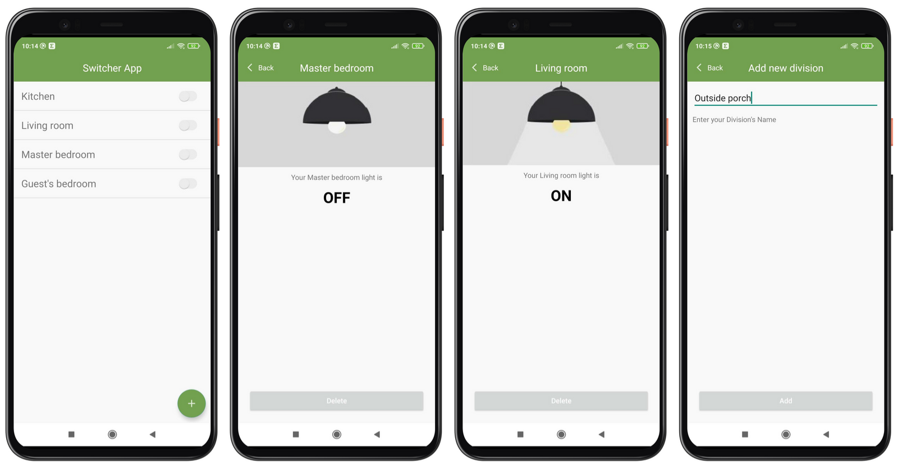

# Android Light Switcher App

A light switcher app. The goal is to simulate controling the lights of a house.
Built using MVVM architecture, Room Database, Coroutines and LiveData.

## Assumptions
* Only the app can change the light status.
* As there's not a endpoint to call to change the light status, the network call is simulated using the Room Database.

## Features
* On first run, you are provided with four preseted divisions.
* Change the light status [ON, OFF] clicking on the switch of each division.
* Check details screen of each division.
* Add and delete divisions.

### Details
* After adding or deleting a division you get a Toast message confirming the operation and you are redirected to the list screen
* When you are on the list screen and you want to exit the app clicking on the back button, you have to press it twice. A Toast message will appear when you click on the back button the first time.
* Use the floating button on the list screen to add a new divison.
* Go to division's details screen if you want to delete it.

## Screenshots

## Future improvments
* Crete a webserverive to manage the light status and make the app call that webservice instead of Room Database.
* For that, we can create a new repository that will be responsible for the network calls and feed the same View Model.